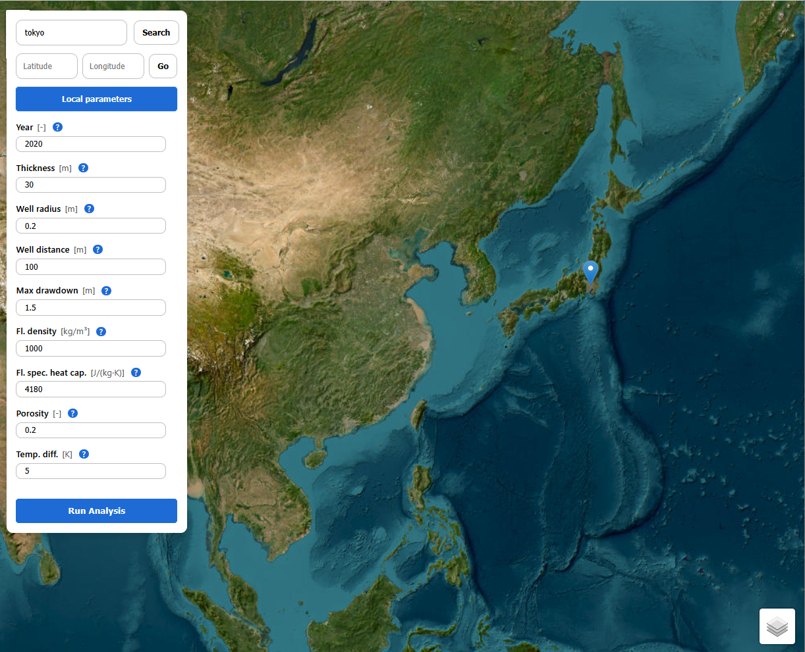
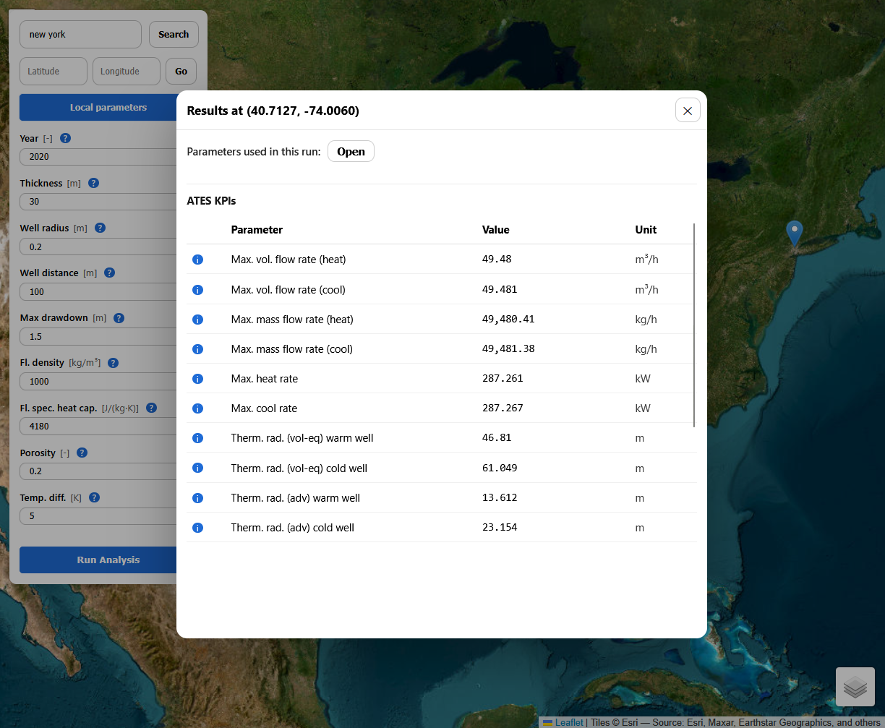
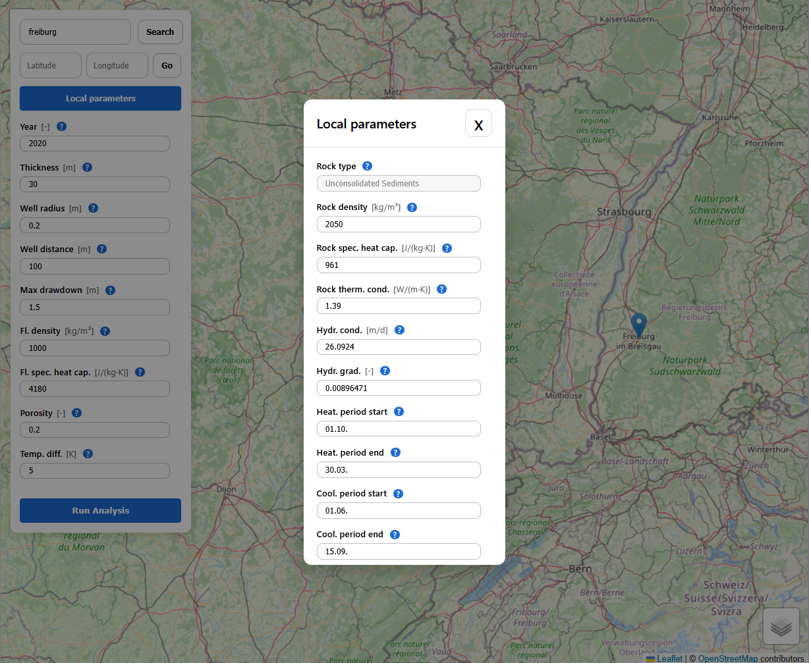

# GeoNinja

GeoNinja is a geospatial decision-support platform for rapid, location-based assessment of subsurface and aquifer properties relevant to Aquifer Thermal Energy Storage (ATES) and related shallow-geothermal applications. It combines curated hydro-geological datasets with a modern web interface and a typed API to enable interactive parameter lookup, transparent assumptions, and reproducible downstream analyses.

<p align="center">
  
  
  
</p>

## Installation

You can currently set up GeoNinja in one of two ways:

### Option 1: Docker setup (recommended for end users)

**Prerequisites**
- Docker (e.g., via Docker Desktop)
- Docker Compose (v2)

With Docker running:

```
docker compose build
docker compose up
```

The second command will also run the data pipeline which can take up to an hour.
Once running, the frontend will be available at ```http://localhost:8080```, and the backend at ```http://localhost:8000```.

### Option 2: Dev Setup (recommended for developers)

This path is intended for active development of the backend and frontend.

**Prerequisites**
- VS Code
- Python >= 3.13
- Conda
- poetry
- Node.js >= 20
- npm

#### Create conda environment and install dependables

We use conda here for environment handling and package installation:

```
conda create -n geoninja python=3.13
conda activate geoninja
conda install rasterio gdal -c conda-forge
```

#### Data pipeline

Before GeoNinja is run for the first time, the data pipeline needs to be run once.

```
cd data_pipeline
poetry install
poetry run python -m geoninja_dp.run
```

#### Backend setup

```
cd backend
poetry install
poetry run uvicorn geoninja_backend.main:app --reload
```

The backend will be available at ```http://localhost:8000```.

**Frontend**

```
cd frontend
npm install
npm run dev
```

The frontend will be available at ```http://localhost:5173```.

### Steps

1. **Clone the ehubX repository.**

2. **Create a new virtual environment:**

   ```
   conda create -n ehubx python=PYTHON_VERSION
   ```

Make sure that the ``PYTHON_VERSION`` you choose is compatible with the current version of ehubX (see *pyproject.toml* in the root directory).

3. **Activate the environment:**

    ```
    conda activate ehubx
    ```

4. **Install [poetry](https://python-poetry.org/) for dependency management**:

    ```
    conda install -c conda-forge poetry
    ```

5. Navigate to the cloned ehubX directory and install using poetry:

    ```
    cd PATH_TO_EHUBX_REPO
    poetry install
    ```

6. Run any of the main scripts in the examples folder to verify the installation.

## Documentation
tbd

## Third-party redistribution
- [GLiM](https://www.geo.uni-hamburg.de/en/geologie/forschung/aquatische-geochemie/glim.html/)
- [GLHYMPS](https://borealisdata.ca/dataset.xhtml?persistentId=doi:10.5683/SP2/DLGXYO/)
- Hydraulic gradient (?)

## Project Info
- Main contact: [Dennis Beermann](dennis.beermann@empa.ch)
- Developers: Dennis Beermann
- Programming Languages: Python, TypeScript
- Contributors: Kathrin Menberg, Robin Mutschler.

## Project Status
In development (see also CHANGELOG.rst)
