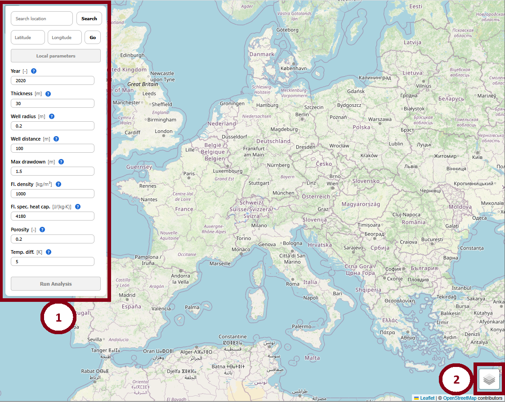
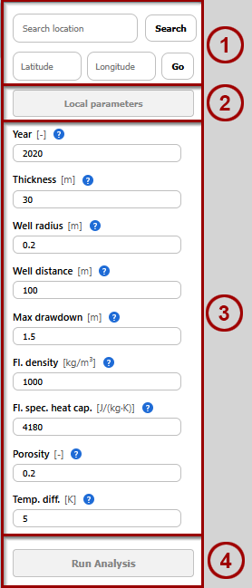
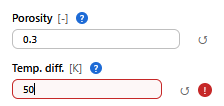
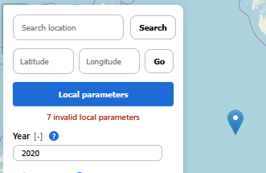
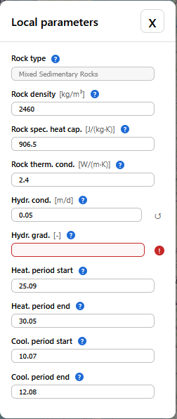
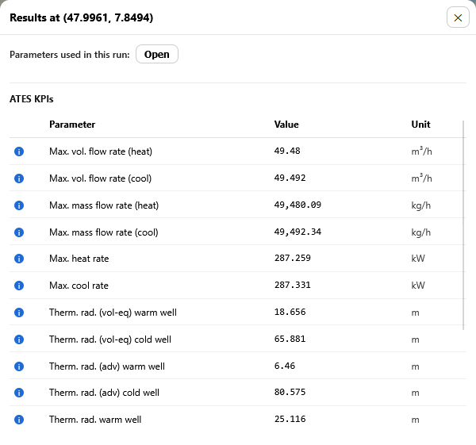

# Usage

The GeoNinja home screen looks like this:

The interface shows a typical interactive map which may be used to navigate to any desired location. The *Control Panel* (1) is the main way the user can interact with the modeling parameters - see the [Control Panel](#the-control-panel) section below. On the lower-right side, a *Layer Selector* (2) allows the user to switch between an OpenSteetMap layer and a satellite-view layer.

## The Control Panel

The ControlPanel is divded into four sections:

### (1) Location Search Bar and Coordinate Navigator

Using either the location search or the Latitude/Longitude navigator will change the the current location, as if it had been set via clicking on the interactive map - see the [Selecting a Location](#selecting-a-location) section below.

### (2) Local Parameters Button

GeoNinja is based partly on location-specific parameters, provided by the backend. Everytime a location is selected on the map, the local parameters at this location are retrieved and cached. They can be viewed and edited through the [Local Parameter](#local-parameter-popup) popup-window, which will open when the "Local parameters" button is clicked in the ControlPanel.

### (3) Static parameters

The ControlPanel holds static parameters which have to be user-specified according to their preference. Standard values are provided as defaults but the user has to double-check their applicability in the modeled scenario.

When the parameters are changed from their default values, an "undo" button will appear next to it, allowing the user to revert back to the default value. Entered values are also checked very roughly for phyiscal validity, and flagged as invalid if they exceed certain tolerances, for example. Further details about the meaning of these parameters are contained in the [Model](model) section of this documentation.

### (4) Run Analysis Button

This button triggers the main GeoNinja analysis routine, using all local and static parameters to calculate import UTES KPIs. It is only clickable when a location is selected and all parameters hold a valid value, whereupon it opens the [Results Panel](#the-results-panel).

## Selecting a Location

Whenever a location is selected on the map via:

* clicking on the map,
* searching for a location in the [Control Panel](#the-control-panel), or
* using the Latitude/Longitude Navigatr in the [Control Panel](#the-control-panel),

local parameters are retrieved from the backend, populating the [Local Parameter pop-up](#local-parameter-pop-up). Depending on the location, the lookup may fail fully or partially. Reasons include:

- Backend not running
- Selected a location on water.
- Selected a location where GeoNinja has no data on certain parameters.

All these cases are treated identically, with a line being shown indicating that some parameters are invalid.

If this is the case, the user should then open the [Local Parameter pop-up](#local-parameter-pop-up) and correct the invalid values by hand.

## Local Parameter pop-up

This pop-up can only be opened after a location has been selected. It contains location-specific parameters which have been retrieved from the backend. Missing or invalid parameters are indicated by a red question mark. When a parameter was changed from the value which was initially retrieved for that location, it can be reset using the "Undo" button to its right. Further details about the meaning of these parameters are contained in the [Model](model) section of this documentation.

## The Results Panel

The Results Panel pops up after an analysis run has concluded.

If contains

* The original location
* A pop-up to view the parameters which were used for that run. These include both the specific static and location-dependent parameters which were set via the [Control Panel](#the-control-panel) but also intermediate properties calculated during the analysis.
* ATES KPIs which are considered the main results from the analysis run.

All of the occuring values are also explained in the [Model](model) section of this documentation.
